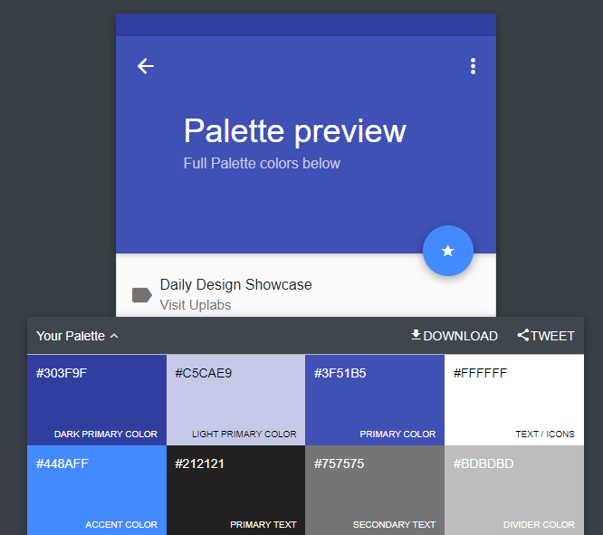
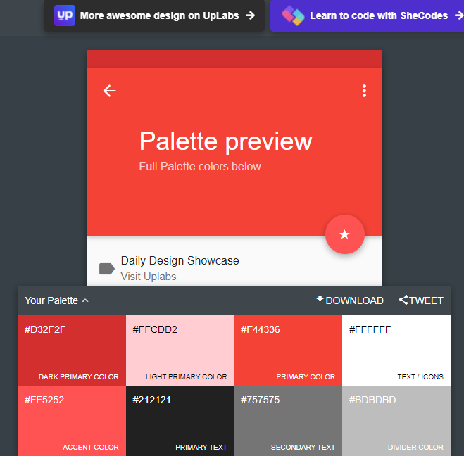
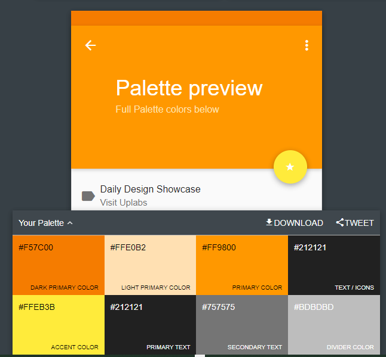
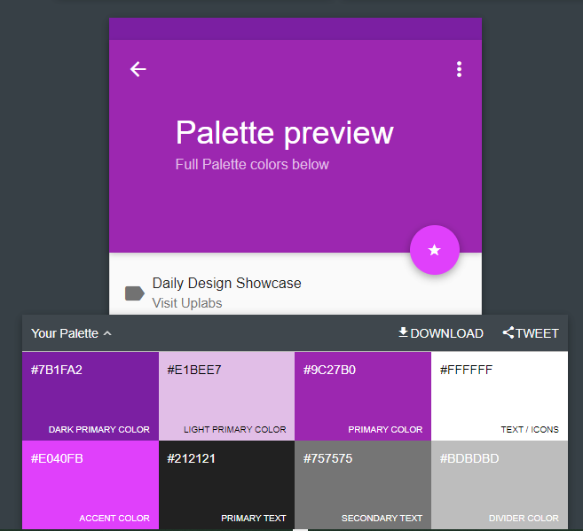
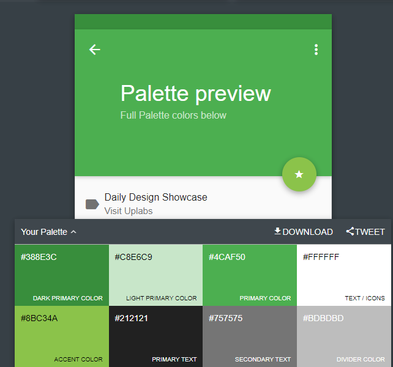
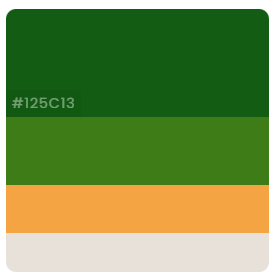

# Gränssnittsdesign
## multiColors

### Emil , Susana och Ursula

 uppgift_1

Skapa 5 olika hemsidor (kan vara samma sida med olika färgtema), en för varje färgtema (röd, gul, grön, blå, lila).
Experimentera med olika font till varje färgtema.

Kan ni skapa logotype så skapa samma för alla 5 men med olika färg kombo typ.

Analogous colors

Complementary colors

Split colors

Triadic colors

Monochromatic colors

##Logo vi använd:

## 5 web hemsidor:

1. Blå färgtema och analogous logotype:

2. Röd färgtema och complementary colors logotype:

3. Gul färgtema split colors logotype:

4. Lila färgtema och triadic colors :

5. Grön färgtema och monochromatic logotype: 

logo färger:

